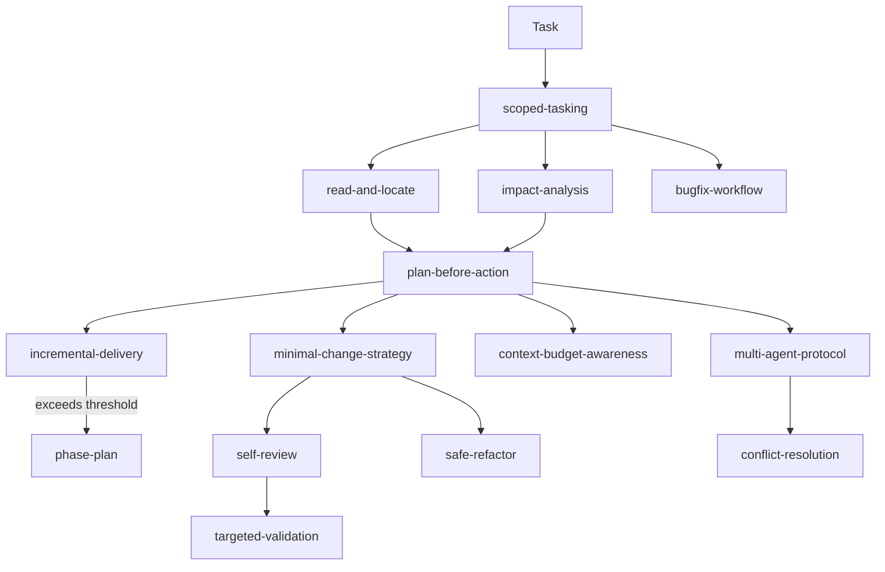
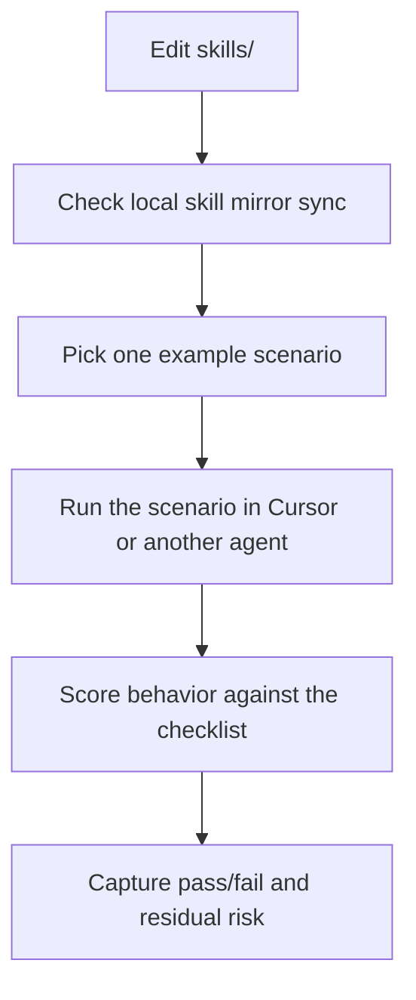

# Agent Execution Skills

This repository is a reusable skill library for coding agents. It focuses on execution discipline and orchestration patterns: how an agent scopes work, plans edits, reads code efficiently, validates narrowly, controls context growth, and coordinates parallel analysis when justified.

It is not a language tutorial, framework guide, product-specific prompt pack, or optimization bundle. The goal is stable working behavior that transfers across agent platforms.

## Repository Map



## What This Repository Is

- A behavior library for coding agents working on real repositories.
- A set of composable skills for narrowing scope, making smaller changes, and reducing avoidable risk.
- A practical reference for single-agent and multi-agent execution patterns.

## What This Repository Is Not

- Not a language or framework knowledge base.
- Not a collection of vendor-specific prompts or UI instructions.
- Not a substitute for project-specific architecture, domain rules, or coding standards.

## Skill Types

### Execution Skills

Execution skills shape how one agent works inside a bounded task. They reduce unnecessary edits, unnecessary reading, and unnecessary validation.

Included execution skills:

- `scoped-tasking`
- `minimal-change-strategy`
- `plan-before-action`
- `targeted-validation`
- `context-budget-awareness`
- `read-and-locate`
- `safe-refactor`
- `bugfix-workflow`
- `impact-analysis`
- `self-review`
- `incremental-delivery`

### Orchestration Skills

Orchestration skills shape how a primary agent coordinates multiple lines of work, especially when analysis can be decomposed without creating coupling or merge confusion.

Included orchestration skills:

- `multi-agent-protocol`
- `conflict-resolution`

## Recommended Starting Composition

For most single-agent coding tasks, start with:

- `scoped-tasking`
- `minimal-change-strategy`
- `plan-before-action`
- `targeted-validation`

This baseline composition creates a disciplined default:

- define the smallest useful boundary
- decide the intended edit before touching files
- prefer the smallest viable patch
- verify only the affected surface first

## When to Add More Skills

Add `context-budget-awareness` when:

- the session is getting long or noisy
- large files or logs are pulling too much attention
- the active objective keeps drifting
- a fresh focused pass would be cheaper than carrying accumulated context

Add `read-and-locate` when:

- the codebase is unfamiliar
- the edit point is not known yet
- you need to identify call paths, boundaries, or ownership quickly

Add `safe-refactor` when:

- the task is structural rather than behavioral
- duplicated logic or local complexity needs cleanup
- you must keep interfaces and behavior stable while improving internals

Add `bugfix-workflow` when:

- the main task is diagnosing or fixing a bug
- symptoms are known but the fault domain is not
- evidence must be gathered before any edit is justified

Add `multi-agent-protocol` when:

- the task can be split into low-coupling subproblems
- multiple hypotheses can be tested independently
- different modules or artifact types can be analyzed in parallel
- read-only exploration benefits from parallel subagents

Add `conflict-resolution` when:

- multiple subagents report overlapping or conflicting conclusions
- evidence must be compared and merged before acting
- uncertainty should be preserved instead of collapsed too early

Add `impact-analysis` when:

- the change touches shared interfaces or public APIs
- the function or type being changed has 3 or more callers
- read-and-locate produced 3 or more tentative leads
- you need to estimate blast radius before planning

Add `self-review` when:

- edits are complete and span multiple files
- you want to catch debug residuals, scope violations, and anti-patterns before running tests
- the user asks for a diff review before testing

Add `incremental-delivery` when:

- the plan spans 2–4 PRs across 1–2 modules
- each increment can be merged and validated independently
- the task is too large for a single PR but too small for the phase system

### Phase Skills

Phase skills provide a schema-first multi-wave execution system for large implementation projects. They are significantly heavier than execution and orchestration skills and should only be introduced when the task warrants structured project-level coordination.

Add `phase-plan`, `phase-execute`, and `phase-contract-tools` when:

- the implementation spans 5 or more PRs across multiple modules
- work must be sequenced into waves with explicit dependencies
- multiple agents need coordinated write access with merge ordering
- the project requires formal handoff artifacts between execution phases

Do not use phase skills for:

- single-session tasks or one-off changes
- tasks with fewer than 3 coordinated PRs
- work that can be managed with `plan-before-action` and `multi-agent-protocol` alone

When in doubt, start with `plan-before-action` plus `multi-agent-protocol` and escalate to phase skills only when wave-level coordination becomes necessary.

## Installation Paths

This repository supports three installation methods. Choose based on your situation.

### OpenSkills (recommended for consumers)

Install all skills into any project via the OpenSkills CLI:

```bash
npx openskills install your-org/agent-skills --universal
npx openskills sync
```

This is the primary recommended path for external consumers.

### Full Skill Governance (recommended for teams)

`manage-governance.py` is the single public entrypoint for this repository's governance tooling. It handles skill copy plus `AGENTS.md` / `CLAUDE.md` rule injection in one place.

Install the full skill library with AGENTS.md rule injection:

```bash
python3 maintainer/scripts/install/manage-governance.py --project /path/to/my-repo
```

### Local Development Mirrors (this repository only)

These mirror operations now run through the same installer script. They are not an end-user install path; they only rebuild repo-local `.cursor/skills/` and `.claude/skills/` mirrors while developing this library.

Generate a project-local tool mirror from the canonical `skills/` tree:

```bash
python3 maintainer/scripts/install/manage-governance.py --sync-local cursor
python3 maintainer/scripts/install/manage-governance.py --sync-local claude
```

These mirrors are project-local (`$REPO_ROOT/.cursor/skills/` and `$REPO_ROOT/.claude/skills/`), ignored by Git, and can be rebuilt at any time. They are not the same as global skill installation.

To verify a mirror is current:

```bash
python3 maintainer/scripts/install/manage-governance.py --check-local cursor
python3 maintainer/scripts/install/manage-governance.py --check-local claude
```

### Path Comparison

| Method | Scope | Target Path | Use When |
|--------|-------|-------------|----------|
| OpenSkills | All skills | `.agent/skills/` | External consumer installing into a project |
| `manage-governance.py` | All skills + rules | `$HOME/.cursor/skills/`, `$HOME/.codex/skills/`, or `$HOME/.claude/skills/` | Team adopting the full discipline suite |
| `manage-governance.py --sync-local <target>` | All skills (mirror) | `$REPO_ROOT/.cursor/skills/` or `$REPO_ROOT/.claude/skills/` | Developing this skill library itself |

## Design Philosophy

- Scope first.
- Plan first.
- Make the smallest viable change.
- Validate narrowly.
- Control context growth.
- Parallelize only when justified.

## Repository Layout

```text
README.md
skills/
  scoped-tasking/
  minimal-change-strategy/
  plan-before-action/
  targeted-validation/
  context-budget-awareness/
  read-and-locate/
  safe-refactor/
  bugfix-workflow/
  impact-analysis/
  self-review/
  incremental-delivery/
  multi-agent-protocol/
  conflict-resolution/
templates/
  governance/
    AGENTS-template.md
    CLAUDE-template.md
  evaluation/
    cross-platform-trigger-baseline.md
    transcript-evaluation-report.md
examples/
  single-agent-bugfix.md
  safe-refactor.md
  read-and-locate.md
  context-budgeted-debugging.md
  multi-agent-root-cause-analysis.md
  phased-migration-planning.md
docs/
  user/
    OPENSKILLS-RELEASE-CHECKLIST.md
  maintainer/
    skill-system-evaluation.md
    test-evaluation-repair-plan.md
maintainer/
  data/
  scripts/
    install/
    evaluation/
  reports/
    baselines/
    runs/
```

## Repository Boundaries

Keep each top-level area narrowly scoped:

- `skills/`: the only canonical published skill source.
- `examples/`: user-visible scenario inputs for behavior testing and documentation.
- `docs/user/`: user-facing operational and release documentation.
- `templates/governance/`: reusable platform-specific governance templates used for installation and rule injection.
- `templates/evaluation/`: evaluation-only report templates used by the maintainer toolchain.
- `maintainer/scripts/install/`: stable user-facing entrypoints for installation and local mirror sync.
- `docs/maintainer/`: maintainer notes, evaluations, and repair plans.
- `maintainer/data/`: shared evaluation fixtures, rubrics, and trigger matrices.
- `maintainer/scripts/evaluation/`: maintainer-only scoring, trigger, and report-generation utilities.
- `maintainer/reports/baselines/`: retained reference outputs that are worth committing.
- `maintainer/reports/runs/`: scratch run output; promote only durable results into `baselines/`.

## Publishing Shape

This repository is published with one canonical skill tree: `skills/`.

That source-of-truth rule matters for installers that recursively scan repositories for `SKILL.md`. Each published skill should exist once in the source tree.

Local tool-specific mirrors and generated install outputs must stay out of the published source tree.

Generated install artifacts in consumer repositories include:

- `.cursor/`
- `.agent/`
- `.claude/`
- `AGENTS.md`

In this repository itself, internal evaluation assets live under `maintainer/` and are not part of the published skill source tree.

## OpenSkills

Use `skills/` as the installation source.

Install all skills from a published repository:

```bash
npx openskills install your-org/agent-skills --universal
npx openskills sync
```

Install one skill directly:

```bash
npx openskills install your-org/agent-skills/skills/scoped-tasking --universal
npx openskills sync
```

For local development against this repository:

```bash
npx openskills install ./skills --universal
npx openskills sync
```

Always install from `./skills`, not from the repository root. Installing from the root causes the OpenSkills scanner to find duplicate skills in generated local directories such as `.agent/skills/`.

`--universal` installs to `.agent/skills/`, which is the safer default for multi-agent setups. If you prefer the default OpenSkills layout, omit `--universal`.

For release readiness and acceptance checks, use [`docs/user/OPENSKILLS-RELEASE-CHECKLIST.md`](docs/user/OPENSKILLS-RELEASE-CHECKLIST.md).

## Governance Setup

The `multi-agent-protocol` skill works best when paired with project-level governance rules. Ready-made platform templates live in `templates/governance/AGENTS-template.md` and `templates/governance/CLAUDE-template.md`.

Those governance files are the routing layer, not per-skill manuals: they define when skills activate, how they hand off, and when they retire, while each skill's detailed behavior stays in its own `SKILL.md`.

The complete supported install flow lives in one script: `maintainer/scripts/install/manage-governance.py`. The installer has a single install semantic: install the full skill library and inject the matching governance rules.

Install both the governance skills and inject the rules into a project:

```bash
python3 maintainer/scripts/install/manage-governance.py --project /path/to/my-repo
```

Install only the skills (no project file changes):

```bash
python3 maintainer/scripts/install/manage-governance.py --project /path/to/my-repo --skills-only
```

Inject only the rules into an existing `AGENTS.md`:

```bash
python3 maintainer/scripts/install/manage-governance.py --project /path/to/my-repo --rules-only
```

Force a specific platform:

```bash
python3 maintainer/scripts/install/manage-governance.py --project /path/to/my-repo --skills-only --platform codex --force
```

The script auto-detects installed platforms (Cursor, Codex, Claude Code) and places skills in the appropriate directory.

## Local Mirrors

If you want local Cursor or Claude discovery while working in this repository, generate a tool-specific mirror from `skills/`:

```bash
python3 maintainer/scripts/install/manage-governance.py --sync-local cursor
python3 maintainer/scripts/install/manage-governance.py --sync-local claude
```

The generated `.cursor/` and `.claude/` trees are local-only, ignored by Git, and can be deleted and rebuilt at any time.

To verify that a local mirror is still current:

```bash
python3 maintainer/scripts/install/manage-governance.py --check-local cursor
python3 maintainer/scripts/install/manage-governance.py --check-local claude
```

Note: These mirrors copy entire skill directories, including subdirectories such as `scripts/`, `references/`, and `fixtures/` for skills that have them. This ensures that relative path references within skill instructions remain valid.

## How to Test Skills

Skill testing in this repository is intentionally lightweight. These skills shape agent behavior, so the most useful checks combine one static verification step with one scenario-based behavior review.



Use this three-part loop:

1. Verify the relevant local mirror is current.
2. Run one or more example scenarios as acceptance tests.
3. Record whether the agent behavior matched the intended skill guardrails.

Before release, also run an OpenSkills install smoke test using the checklist in [`docs/user/OPENSKILLS-RELEASE-CHECKLIST.md`](docs/user/OPENSKILLS-RELEASE-CHECKLIST.md).

For a quick introduction to skill testing with practical scenarios, see [`docs/user/SKILL-TESTING-QUICK-START.md`](docs/user/SKILL-TESTING-QUICK-START.md).

For high-value Claude Code multi-turn acceptance scenarios, use
[`docs/maintainer/claude-interactive-test-checklist.md`](docs/maintainer/claude-interactive-test-checklist.md)
and the fixture-backed execution plan in
[`docs/maintainer/claude-interactive-test-implementation-plan.md`](docs/maintainer/claude-interactive-test-implementation-plan.md).

### 1. Static Verification

Use the built-in local mirror checker after every change to `skills/`:

```bash
python3 maintainer/scripts/install/manage-governance.py --check-local cursor
python3 maintainer/scripts/install/manage-governance.py --check-local claude
```

If the mirror is out of date, rebuild it:

```bash
python3 maintainer/scripts/install/manage-governance.py --sync-local cursor
python3 maintainer/scripts/install/manage-governance.py --sync-local claude
```

### 2. Scenario-Based Acceptance Testing

The `examples/` directory is the primary behavior test suite. Each example defines:

- a task shape
- a recommended skill composition
- expected execution patterns
- guardrails that should appear in the agent behavior

Recommended examples:

- `examples/single-agent-bugfix.md`
- `examples/read-and-locate.md`
- `examples/safe-refactor.md`
- `examples/context-budgeted-debugging.md`
- `examples/multi-agent-root-cause-analysis.md`
- `examples/phased-migration-planning.md`
- `examples/impact-analysis.md`
- `examples/self-review.md`
- `examples/incremental-delivery.md`
- `examples/skill-definition-validator.md`
- `examples/refactor-installation-script.md`
- `examples/fix-skill-references.md`

When testing, evaluate behavior rather than only the final answer. For example:

- Did the agent declare scope before exploring?
- Did it plan before editing?
- Did it keep the change local?
- Did it choose targeted validation instead of defaulting to a full suite?
- Did it preserve uncertainty when the evidence was incomplete?

### 3. Generate a Report Skeleton

Use the helper script to print the example-to-skill matrix:

```bash
python3 maintainer/scripts/evaluation/generate-skill-test-report.py
```

Generate a Markdown report template for a manual test pass in the scratch runs area:

```bash
python3 maintainer/scripts/evaluation/generate-skill-test-report.py --write-report maintainer/reports/runs/skill-test-report.md
```

Optionally include the local mirror sync check in the same command:

```bash
python3 maintainer/scripts/evaluation/generate-skill-test-report.py --check-sync --write-report maintainer/reports/runs/skill-test-report.md
```

The generated report is designed for lightweight regression checks across skill revisions. It does not replace human review of agent behavior. Copy only durable reference runs into `maintainer/reports/baselines/`.

## How to Use

Use these skills as composable working constraints, not as rigid scripts.

1. Start with the smallest set of skills that fits the task.
2. Add skills only when the task shape justifies them.
3. Keep the active composition aligned with the current objective.
4. Remove or ignore skills that no longer provide signal for the current step.

## Design Bias

This repository intentionally favors smaller moves over broader automation. That bias trades some speed for lower error rate, lower review cost, and easier recovery when a line of work turns out to be wrong.
