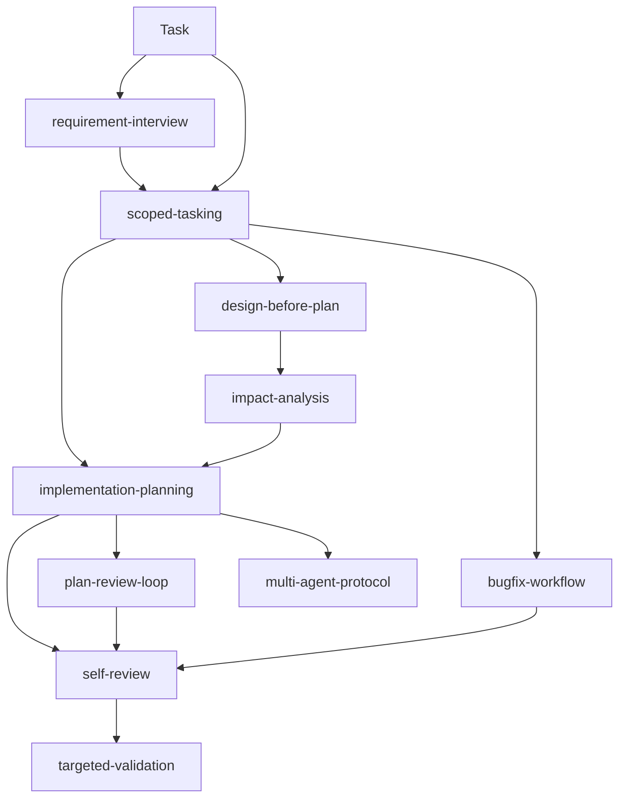

# Agent Execution Skills

This repository is a reusable skill library for coding agents. It focuses on execution discipline and orchestration patterns that still add signal for modern agents: scoping, design decisions, evidence-first debugging, safe refactoring, impact analysis, validation choice, and self-review.

## Repository Map


```mermaid
flowchart TD
    T[Task] --> RI[requirement-interview]
    RI --> S[scoped-tasking]
    T[Task] --> S[scoped-tasking]
    S --> B[bugfix-workflow]
    S --> IP[implementation-planning]
    S --> D[design-before-plan]
    D --> IA[impact-analysis]
    IA --> IP
    IP --> PR[plan-review-loop]
    IP --> SR[self-review]
    PR --> SR
    B --> SR
    SR --> V[targeted-validation]
    IP --> O[multi-agent-protocol]
```

## What This Repository Is

- A behavior library for coding agents working on real repositories.
- A set of composable skills for bounded work, safer changes, and lower review risk.
- A practical reference for single-agent and multi-agent execution.

## Skill Types

### Execution Skills

- `requirement-interview`
- `scoped-tasking`
- `targeted-validation`
- `safe-refactor`
- `bugfix-workflow`
- `impact-analysis`
- `self-review`
- `design-before-plan`
- `architecture-design`
- `implementation-planning`
- `requirements-review-loop`
- `design-review-loop`
- `plan-review-loop`
- `code-review-loop`
- `test-review-loop`

### Orchestration Skills

- `multi-agent-protocol`

### Project Governance Skills

- `manage-agents-md`

## Recommended Starting Composition

For most coding tasks, start with the smallest skill set that fits the work. Add skills only when the task shape justifies them.

- Use `requirement-interview` when a feature request is vague at the business level (unclear goal, roles, main flow, scope, or acceptance criteria) and must be clarified before coding or design.
- Use `scoped-tasking` for broad or ambiguous requests.
- For multi-file or uncertain sequencing, use `AGENTS.md` Behavioral Guidelines §4 for lightweight short planning, and upgrade to `implementation-planning` when the work needs a durable, reviewable plan artifact.
- Use `bugfix-workflow` for unconfirmed failures.
- Use `safe-refactor` for behavior-preserving structural cleanup.
- Use `impact-analysis` for shared interfaces or broad caller impact.
- Use `self-review` and `targeted-validation` after edits.
- Use `multi-agent-protocol` when independent subagent lanes are justified.
- Use the `*-review-loop` family when the user asks to review/validate/finalize an artifact (requirements / design / plan / code / tests). Pick the loop by artifact type.
- Use `manage-agents-md` when the user asks to initialize or update a project's `AGENTS.md`.

## User Manual

- [`docs/manual/README.md`](docs/manual/README.md) - `Agent Skills 使用手册`
- [`docs/manual/QUICK-START.md`](docs/manual/QUICK-START.md) - `快速开始`
- [`docs/manual/FAQ.md`](docs/manual/FAQ.md) - `常见问题`

## Installation

Install governance skills and user-level rules:

```bash
python3 maintainer/scripts/install/manage-governance.py install user
```

Check the user-level installation:

```bash
python3 maintainer/scripts/install/manage-governance.py verify user
```

Install both governance skills and project rules for a shared repository:

```bash
python3 maintainer/scripts/install/manage-governance.py install project /path/to/my-repo
```

Reinstall and replace existing managed governance sections:

```bash
python3 maintainer/scripts/install/manage-governance.py install user --replace-rules
```

Reinstall and overwrite existing managed skill installations:

```bash
python3 maintainer/scripts/install/manage-governance.py install user --overwrite-skills
```

Cursor does not have an official user-level `AGENTS.md` path. User install still installs Cursor skills, but copy the governance content into Cursor User Rules manually when you want the same user-level routing behavior in Cursor. If you already copied older rules, replace the old `Behavioral Guidelines` section so the parallelism decision block is present.

ZCode has official user-level `AGENTS.md` and skills paths. Use `--platform zcode` to install skills into `~/.zcode/skills` and governance into `~/.zcode/AGENTS.md`. Official docs currently document only the user-level skill path, so this installer does not automate project-local ZCode skill installation; use ZCode's Skill import flow for project-local copies when needed.

## Repository Layout

```text
README.md
skills/
  bugfix-workflow/
  code-review-loop/
  architecture-design/
  design-before-plan/
  design-review-loop/
  impact-analysis/
  implementation-planning/
  multi-agent-protocol/
  plan-review-loop/
  manage-agents-md/
  requirement-interview/
  requirements-review-loop/
  safe-refactor/
  scoped-tasking/
  self-review/
  targeted-validation/
  test-review-loop/
templates/
  governance/
docs/
  manual/
  user/
  maintainer/
maintainer/
  data/
  scripts/
```

## Maintainer Notes

The canonical published skill source is `skills/`. The repository no longer maintains repo-local `.cursor/skills/` or `.claude/skills/` mirrors.

After changing skills, run targeted repository checks and one temporary-project install smoke test before publishing.
