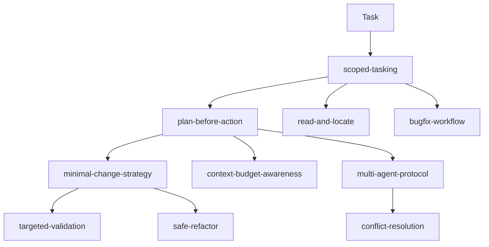
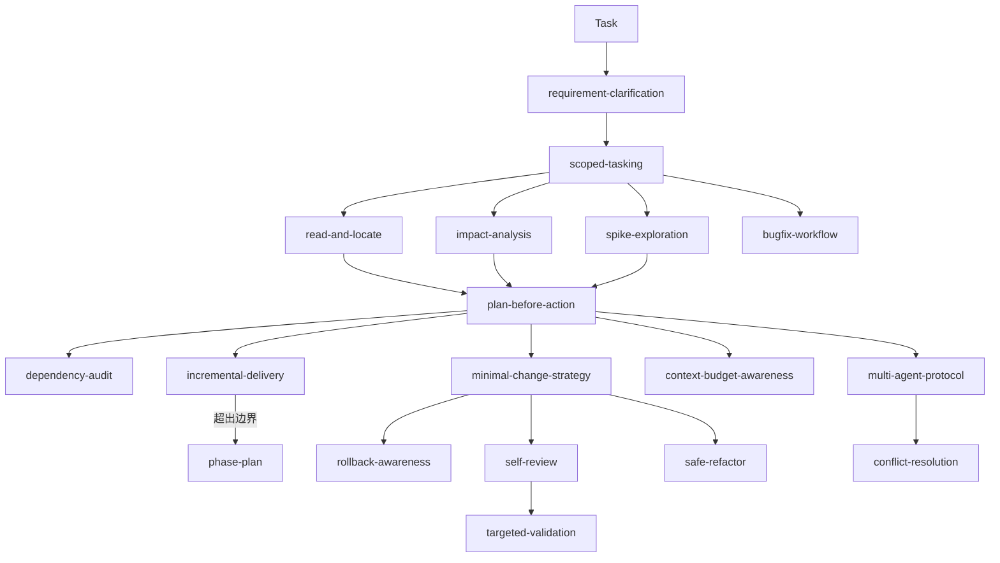

# Pre-Phase 技能缺口分析

> 分析日期：2026-04-09
> 上游评估：`docs/maintainer/skill-system-evaluation.md`
> 状态：提案

---

## 背景

当前技能管线在 execution 层（8 个技能）和 phase 系统（3 + 1 个技能）之间存在能力空白。具体表现：

- `plan-before-action` 面向单次编辑场景，phase 系统面向 5+ PR 的多波次大型项目。
- 2–4 个 PR 规模的任务没有合适的拆分和交付框架。
- 需求澄清、影响面评估、变更自审等行为纪律在现有技能中缺乏覆盖。

`skill-system-evaluation.md` 指出的"阶段系统复杂度跳跃大"和"缺少反模式检测"也佐证了这一空白。

---

## 当前管线

Phase 技能（`phase-plan` → `phase-plan-review` → `phase-execute`）仅在 5+ PR、多波次、多模块协调时启用。

---

## 提议新增技能

### 1. `requirement-clarification`

**管线位置**：`scoped-tasking` 之前

**解决的问题**：

- `scoped-tasking` 假设需求已知，只负责收窄边界。
- Agent 在需求模糊时就开始收窄范围，导致方向错误。
- 用户给出的任务描述可能有歧义、隐含假设、或缺少验收标准。

**核心规则**：

- 识别需求中的歧义点和隐含假设。
- 列出确认问题清单（"我理解的是 X，确认是否正确"）。
- 区分"必须做"和"最好做"。
- 明确验收标准后再进入 `scoped-tasking`。

**输入**：用户原始任务描述、相关上下文。

**输出**：澄清后的需求摘要、验收标准、进入 `scoped-tasking` 的输入。

**组合**：输出直接供 `scoped-tasking` 消费。

---

### 2. `impact-analysis`

**管线位置**：`scoped-tasking` 之后、`plan-before-action` 之前

**解决的问题**：

- `read-and-locate` 负责"找到代码在哪"，但不评估"改了之后会影响什么"。
- `plan-before-action` 制定计划时缺少影响面信息。
- Agent 常低估变更的连锁反应（调用者、依赖方、配置、测试）。

**核心规则**：

- 追踪变更点的上游调用者和下游依赖。
- 标记会受影响的模块、API、配置。
- 估算变更的"爆炸半径"（blast radius）。
- 输出影响面摘要供 `plan-before-action` 消费。

**输入**：`scoped-tasking` 的范围输出、`read-and-locate` 的定位结果。

**输出**：影响面摘要（受影响文件/模块列表、风险等级、连锁变更说明）。

**组合**：依赖 `read-and-locate`；输出供 `plan-before-action` 消费。

---

### 3. `spike-exploration`

**管线位置**：`plan-before-action` 的替代/前置路径

**解决的问题**：

- 当前系统假设 Agent 可以直接从"收窄范围"跳到"制定计划"。
- 某些任务（新 API 对接、未知框架行为、性能瓶颈定位）需要先验证可行性。
- 没有"允许失败的探索"概念，导致探索性尝试混入正式实现。

**核心规则**：

- Spike 必须有步骤/时间上限。
- Spike 产物是"发现"而非"代码"——spike 代码不进入主分支。
- Spike 结束时输出：可行、不可行、或需要更多信息。
- 如果可行，输出关键发现供 `plan-before-action` 消费。

**输入**：`scoped-tasking` 的范围输出、待验证的技术假设。

**输出**：可行性结论、关键发现、进入 `plan-before-action` 的建议（或放弃建议）。

**组合**：与 `plan-before-action` 为替代路径关系——先 spike 再 plan，或直接 plan。

---

### 4. `incremental-delivery`

**管线位置**：`plan-before-action` 之后、phase 系统之前（中间地带）

**解决的问题**：

- `plan-before-action` 面向单次编辑，phase 系统面向 5+ PR——存在明显断层。
- 2–4 个 PR 规模的任务没有合适的拆分框架。
- `skill-system-evaluation.md` 指出"阶段系统复杂度跳跃大，适用场景阈值不够清晰"。

**核心规则**：

- 将计划拆分为 2–4 个可独立合并的增量。
- 每个增量必须保持系统可运行状态。
- 增量之间的依赖关系必须显式声明。
- 如果增量超过 4 个或依赖关系需要跨模块协调，升级到 phase 系统。

**输入**：`plan-before-action` 的计划输出。

**输出**：增量拆分（每个增量包含：范围、依赖、验收标准、合并顺序）。

**组合**：接收 `plan-before-action` 输出；超出边界时升级到 `phase-plan`。

**升级阈值**：

| 条件 | 留在 `incremental-delivery` | 升级到 `phase-plan` |
|------|---------------------------|-------------------|
| PR 数量 | 2–4 | 5+ |
| 模块跨度 | 1–2 个模块 | 3+ 模块 |
| 并行需求 | 可串行交付 | 需要并行 lane |
| 交接复杂度 | 增量间仅有合并顺序依赖 | 需要正式交接清单 |

---

### 5. `self-review`

**管线位置**：`targeted-validation` 之前或并行

**解决的问题**：

- `targeted-validation` 关注"运行什么测试来验证"，而非"审视 diff 本身"。
- Agent 最常见的低级错误（遗漏文件、不一致的命名、多余的调试代码、破坏性的副作用）在 diff 审查中最容易发现。
- `skill-system-evaluation.md` 指出缺少反模式检测。

**核心规则**：

- 逐文件审查 diff，检查是否有超出任务范围的修改。
- 检查是否引入了调试代码、硬编码值、未处理的错误路径。
- 验证命名一致性和接口兼容性。
- 确认所有修改都与声明的计划对齐。

**常见反模式检查清单**：

- 包含 `console.log`、`print()`、`TODO: remove` 等调试残留。
- 修改了计划范围外的文件。
- 引入了硬编码的路径、密钥、或环境特定值。
- 函数签名变更但调用者未同步更新。
- 错误路径只有 `pass` 或空 `catch` 块。

**输入**：当前工作区的 diff。

**输出**：审查结论（clean / has-issues）、问题列表（逐项带位置和建议修复）。

**组合**：与 `targeted-validation` 互补——self-review 审查 diff 质量，targeted-validation 验证行为正确性。

---

### 6. `rollback-awareness`

**管线位置**：`minimal-change-strategy` 的伴生技能

**解决的问题**：

- 当前系统优化"怎么做最小改动"，但不关注"如果错了怎么退回"。
- Phase 系统在 `phase-plan-review` 中覆盖了风险和回退，但非 phase 任务完全缺失。
- 不可逆操作（数据库 schema 变更、外部 API 调用、文件删除）需要额外注意。

**核心规则**：

- 每个变更前声明回退策略（`git revert` 是否足够？是否需要数据迁移回退？）。
- 识别不可逆操作并标记。
- 对不可逆操作要求额外确认。
- 越小的改动越容易回退——与 `minimal-change-strategy` 自然互补。

**触发条件**：

- 变更涉及数据库 schema、持久化存储格式。
- 变更涉及外部 API 调用或 webhook 注册。
- 变更涉及文件/目录删除或重命名。
- 变更涉及权限、认证、加密配置。

**输入**：计划中的变更列表。

**输出**：每项变更的可逆性评估、回退策略、不可逆操作的风险标注。

**组合**：与 `minimal-change-strategy` 伴生；纯代码重构场景下可不加载。

---

### 7. `dependency-audit`

**管线位置**：`plan-before-action` 的可选伴生

**解决的问题**：

- 变更常涉及第三方库升级、API 版本变化、运行时环境差异。
- Agent 容易忽略依赖兼容性问题。
- 安全漏洞和弃用 API 需要在计划阶段发现。

**核心规则**：

- 检查变更涉及的外部依赖版本和兼容性。
- 标记已弃用或有已知安全问题的依赖。
- 评估 lock file 变更的影响。
- 对依赖变更提出最小化建议。

**触发条件**：

- 计划中包含新增或升级依赖。
- 变更涉及调用外部服务/API。
- Lock file 出现大范围变更。

**输入**：计划中的变更列表、当前依赖清单。

**输出**：依赖风险摘要、兼容性问题列表、建议修复。

**组合**：与 `plan-before-action` 伴生；触发频率低，按需加载。

---

## 更新后的管线

---

## 优先级排序

| 优先级 | 技能 | 理由 |
|--------|------|------|
| **P0** | `impact-analysis` | 填补 `read-and-locate` 与 `plan-before-action` 之间最关键的信息缺口。Agent 因缺少影响面信息导致的计划偏差是最常见的失败模式之一。 |
| **P0** | `incremental-delivery` | 解决 `plan-before-action` 与 phase 系统之间的复杂度断层。直接回应评价报告中的"复杂度跳跃"问题。 |
| **P0** | `self-review` | 低成本高收益。diff 审查在所有任务中都适用，直接减少低级错误率。 |
| **P1** | `requirement-clarification` | 对模糊任务价值大，但部分场景中用户会主动给出清晰需求，触发频率低于 P0 技能。 |
| **P1** | `rollback-awareness` | 对有副作用的变更至关重要，但纯代码重构场景不需要。 |
| **P2** | `spike-exploration` | 适用场景窄，主要面向对接未知系统或框架时的可行性验证。 |
| **P2** | `dependency-audit` | 价值实在但触发频率低，多数变更不涉及依赖变化。 |

---

## 实施建议

1. **先实现 P0 三个技能**（`impact-analysis`、`incremental-delivery`、`self-review`），它们填补的缺口最明显且与现有技能的组合关系最清晰。
2. 每个新技能遵循现有 `SKILL.md` 统一结构（Purpose → When to Use → Core Rules → Execution Pattern → I/O Contract → Guardrails → Composition → Example）。
3. 每个新技能需配套一个 `examples/` 场景文件用于行为验收测试。
4. 在 README 管线图和"When to Add More Skills"章节中补充新技能的位置和触发条件。
5. 在 `AGENTS-template.md` 的"升级条件"中补充对应的升级路径。
6. `incremental-delivery` 需要与 `phase-plan` 的"适用场景阈值"对齐，明确交界处的判断标准。
