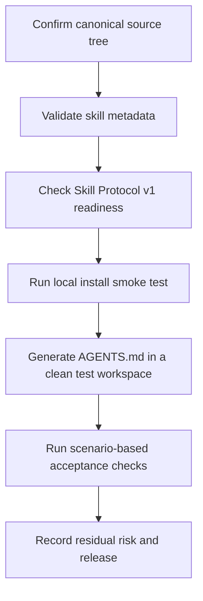

# OpenSkills Release Checklist

Use this checklist before publishing the repository as an OpenSkills source or cutting a release tag.

## Release Flow



## Scope

This checklist assumes:

- `skills/` is the only canonical skill source
- generated local artifacts are not part of the published source
- OpenSkills consumers install from the repository root or directly from `skills/`
- Skill Protocol v1 is the active repository protocol for all skill families

## 1. Canonical Source Boundary

Confirm that published skills exist only once in the source tree.

- [ ] All canonical skills live under `skills/`
- [ ] No mirrored `SKILL.md` files exist under `.cursor/`, `.agent/`, or `.claude/`
- [ ] `AGENTS.md` is treated as generated local output, not release content
- [ ] `.gitignore` excludes local generated directories and files

Recommended spot checks:

```bash
rg --files -g 'SKILL.md'
```

Expected result:

- only `skills/<skill-name>/SKILL.md` paths appear in the release source

## 2. Skill Metadata Sanity

Check that each skill is installable and discoverable.

- [ ] Every `SKILL.md` starts with YAML frontmatter
- [ ] Every skill defines `name`
- [ ] Every skill defines `description`
- [ ] Directory names and `name` fields are aligned
- [ ] Skill names are unique across the repository

Minimum expectations:

- OpenSkills should be able to infer one installable skill per canonical directory
- descriptions should be concise enough for discovery and specific enough for selection

## 3. OpenSkills Install Smoke Test

Run this in a clean throwaway test workspace, not in the source repository root.

```bash
mkdir -p /tmp/openskills-smoke-test
cd /tmp/openskills-smoke-test
npx openskills install /path/to/agent-skills/skills --universal
npx openskills sync -y
npx openskills list
npx openskills read scoped-tasking
```

## 3.5. Skill Protocol v1 Readiness

Before release, confirm that the repository-wide protocol is coherent across templates, skills, examples, and evaluation tooling.

- [ ] Every skill under `skills/` includes the required v1 sections for its family
- [ ] Governance templates describe the seven standard protocol blocks and family budgets
- [ ] Governance templates stay at the routing layer and defer per-skill procedures to `SKILL.md`
- [ ] `examples/` show v1 protocol block sequences
- [ ] Trigger and smoke tooling can report protocol-readiness or protocol-block failures

Recommended checks:

```bash
python3 maintainer/scripts/evaluation/run_trigger_tests.py --mode report --fail-on-protocol-issues
python3 -m py_compile maintainer/scripts/evaluation/run_trigger_tests.py maintainer/scripts/evaluation/run_claude_trigger_smoke.py maintainer/scripts/evaluation/skill_protocol_v1.py
```

Pass criteria:

- [ ] Skills install without duplicate-name confusion
- [ ] Install target is `.agent/skills/` when `--universal` is used
- [ ] `AGENTS.md` is generated successfully
- [ ] Generated governance remains a routing document, not a duplicated skill manual
- [ ] `openskills list` shows the expected skills
- [ ] `openskills read scoped-tasking` returns the expected skill content

If you are validating a published repository instead of a local path:

```bash
npx openskills install your-org/agent-skills --universal
```

If you are validating one skill directly:

```bash
npx openskills install your-org/agent-skills/skills/scoped-tasking --universal
```

## 4. Scenario-Based Acceptance

Choose representative scenarios and verify that the loaded skills change agent behavior in the intended way.

Recommended minimum:

- [ ] One single-agent example
- [ ] One structural refactor example
- [ ] One multi-agent or conflict-resolution example
- [ ] One phase-planning example

Suggested source scenarios:

- `examples/single-agent-bugfix.md`
- `examples/safe-refactor.md`
- `examples/multi-agent-root-cause-analysis.md`

Behavior checks:

- [ ] Scope is narrowed before broad exploration
- [ ] The agent plans before editing
- [ ] The proposed change stays small and local
- [ ] Validation stays targeted unless risk justifies expansion
- [ ] Parallelism is used only when the task is low-coupling
- [ ] Uncertainty is preserved when evidence is incomplete
- [ ] Protocol blocks appear in the expected order and skill outputs are paired with output validation

## 5. Local Tooling Separation

Local convenience layers are allowed, but they must remain clearly outside the published source boundary.

- [ ] Cursor and Claude mirrors are regenerated from `skills/`, not hand-maintained
- [ ] `.cursor/` stays ignored by Git
- [ ] Local OpenSkills outputs such as `.agent/`, `.claude/`, and `AGENTS.md` stay ignored by Git
- [ ] `maintainer/` contains internal evaluation assets only, not installable skill source
- [ ] Release notes and README do not imply that generated local artifacts are canonical source

## 6. Release Decision

Release only when:

- [ ] canonical source is clean
- [ ] Skill Protocol v1 readiness checks pass
- [ ] install smoke test passes
- [ ] scenario acceptance checks pass at the desired confidence level
- [ ] any residual risk is documented

If a release is blocked, record:

- the failing gate
- the observed evidence
- whether the issue is structural, install-time, or behavior-level
- the smallest next action required to unblock release
