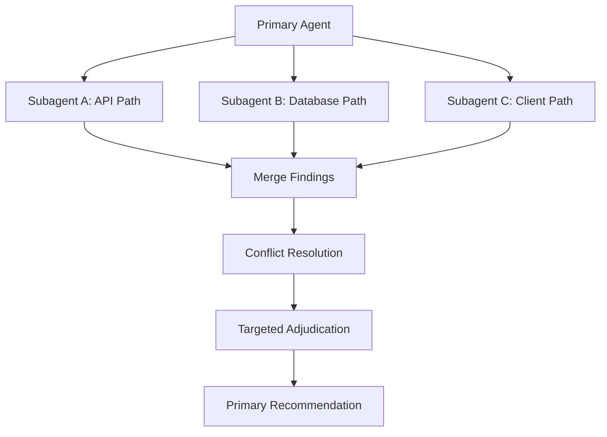

# Multi-Agent Root Cause Analysis

## Scenario

Checkout latency spikes intermittently. Evidence may live in the API path, database access path, and client request behavior. The task is analysis-first, not immediate editing.

## Recommended Skill Composition

- `scoped-tasking`
- `plan-before-action`
- `multi-agent-protocol`
- `conflict-resolution`
- `targeted-validation`

## Orchestration Flow



## Why Parallelism Is Justified

- The suspected fault domains are low-coupling.
- Each line of investigation can be described independently.
- The primary agent can merge findings without overlapping code edits.

Parallelism is not justified if all paths collapse into the same reducer file or the same narrow edit surface.

## Example Subagent Assignments

### Subagent A: API Path

- Scope: checkout handler, service layer, request fan-out
- Goal: identify whether latency is introduced before database access
- Output format:
  - Findings
  - Evidence
  - Uncertainty
  - Recommendation

### Subagent B: Database Path

- Scope: checkout queries, indexes, transaction boundaries
- Goal: identify whether query shape or locking explains the spike
- Output format:
  - Findings
  - Evidence
  - Uncertainty
  - Recommendation

### Subagent C: Client Path

- Scope: batching, retry, duplicate request behavior
- Goal: identify whether client behavior amplifies latency
- Output format:
  - Findings
  - Evidence
  - Uncertainty
  - Recommendation

## Primary Agent Responsibilities

1. Define the split and stop conditions.
2. Ensure the subagents do not edit overlapping areas unless explicitly allowed.
3. Normalize outputs into comparable claims.
4. Use `conflict-resolution` to separate consensus from disagreement.
5. Choose the smallest adjudication step if findings conflict.

## Example Merge Outcome

- Consensus: spikes correlate with a slow query branch under one checkout option.
- Disagreement: API-path analysis blames request fan-out, while database-path analysis blames one missing index.
- Evidence weighting: query timing and execution-plan evidence is stronger than timing-only handler observations.
- Adjudication: run one targeted request with the fan-out path disabled and compare query latency directly.

## Guardrails

- Keep the subagent count between 2 and 4 unless there is a strong reason to exceed it.
- Do not allow recursive subagent spawning by default.
- Keep final synthesis with the primary agent.
- Use targeted adjudication rather than forcing certainty from weak evidence.

## Skill Protocol v1 Trace

```yaml
[task-input-validation]
task: "Investigate checkout latency across API, database, and client paths in parallel."
checks:
  clarity:
    status: PASS
    reason: "The investigation areas and parallel intent are explicit."
  scope:
    status: PASS
    reason: "The three paths form a bounded analysis split."
  safety:
    status: PASS
    reason: "This is read-first orchestration work."
  skill_match:
    status: PASS
    reason: "multi-agent-protocol and conflict-resolution fit directly."
result: PASS
action: proceed
[/task-input-validation]

[trigger-evaluation]
task: "Run a three-lane latency investigation."
evaluated:
  - multi-agent-protocol: ✓ TRIGGER
  - conflict-resolution: ⏸ DEFER
  - targeted-validation: ⏸ DEFER
activated_now: [multi-agent-protocol]
deferred: [conflict-resolution, targeted-validation]
[/trigger-evaluation]

[precondition-check: multi-agent-protocol]
checks:
  - split_is_low_coupling: ✓ PASS
  - lane_contracts_defined: ✓ PASS
result: PASS
[/precondition-check]

[skill-output: multi-agent-protocol]
status: completed
confidence: high
outputs:
  split_dimension: "by suspected fault domain"
  lanes: ["api path", "database path", "client path"]
  integration_plan: "merge findings, compare evidence, adjudicate only if needed"
  synthesis: "database timing evidence is strongest but one API-path disagreement remains"
signals:
  adjudication_needed: true
recommendations:
  downstream_skill: "conflict-resolution"
[/skill-output]

[output-validation: multi-agent-protocol]
checks:
  - outputs.split_dimension: ✓ PASS
  - outputs.synthesis: ✓ PASS
result: PASS
[/output-validation]

[skill-deactivation: multi-agent-protocol]
reason: "Lane findings have been collected and handed to synthesis."
outputs_consumed_by: [conflict-resolution]
remaining_active: [conflict-resolution]
[/skill-deactivation]
```
