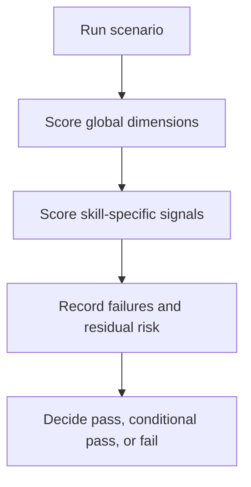

# Skill Evaluation Rubric

## Scenario

You want a repeatable scoring standard for reviewing whether an agent actually demonstrated the intended skill behavior during a scenario run.

## Recommended Skill Composition

- `scoped-tasking`
- `plan-before-action`
- `targeted-validation`

## Review Model

## Scoring Scale

| Score | Meaning |
| --- | --- |
| `2` | Clearly demonstrated and materially useful |
| `1` | Partially demonstrated, ambiguous, or inconsistently applied |
| `0` | Missing, contradicted, or replaced by the opposite behavior |

## Global Dimensions

Score these dimensions for every scenario:

| Dimension | Pass Signal | Failure Signal |
| --- | --- | --- |
| Scope discipline | The agent stays inside the smallest justified boundary | The agent drifts into broad exploration without evidence |
| Planning discipline | The agent states assumptions, working set, and intended sequence before editing | The agent edits before a clear plan exists |
| Change discipline | The agent prefers the smallest viable change or recommendation | The agent bundles unrelated cleanup or broad rewrites |
| Validation discipline | The agent chooses the narrowest meaningful check first | The agent defaults to broad validation without justification |
| Uncertainty handling | The agent preserves ambiguity and residual risk | The agent overclaims confidence or collapses conflicting evidence |
| Skill lifecycle | Skills are loaded on demand and dropped when their phase ends; no more than 4 active simultaneously without justification | Unnecessary skills are carried throughout the session; the context budget grows from stale skill guidance |

## Skill-Specific Pass vs. Fail

### `scoped-tasking`

- Pass: proposes a bounded initial working set and explains each scope expansion.
- Fail: scans widely by reflex or expands scope without stating why.

### `plan-before-action`

- Pass: states goal, assumptions, intended files, and next actions before non-trivial edits.
- Fail: starts editing while the plan or file list is still fuzzy.

### `minimal-change-strategy`

- Pass: selects a local, reviewable patch and defers unrelated cleanup.
- Fail: mixes the main task with cosmetic rewrites, renames, or opportunistic refactors.

### `targeted-validation`

- Pass: first validation step directly exercises the changed or analyzed surface.
- Fail: jumps to full builds or broad test suites without explicit risk-based reasoning.

### `context-budget-awareness`

- Pass: compresses the session state, drops stale hypotheses, and resumes from a smaller fault domain.
- Fail: preserves dead ends and keeps re-reading noisy artifacts without a sharper question.

### `read-and-locate`

- Pass: starts from the strongest clue and identifies likely edit points without repo-wide drift.
- Fail: reads large unrelated areas before establishing the local ownership path.

### `safe-refactor`

- Pass: states invariants and performs behavior-preserving structural changes in small steps.
- Fail: silently changes interfaces, output shape, or user-visible behavior.

### `bugfix-workflow`

- Pass: clarifies the symptom and fault domain before applying a fix.
- Fail: patches speculative causes without confirming the failure path.

### `multi-agent-protocol`

- Pass: uses tiered parallelism appropriately — Tier 1 for read-only exploration, Tier 2 with an explicit gate declaration for write-capable delegation — with clear assignments and merge expectations.
- Fail: splits tightly coupled work, launches overlapping write scopes, skips the Tier 2 gate declaration, or conflates explore and delegate tiers.

### `conflict-resolution`

- Pass: compares overlapping findings by evidence quality and preserves uncertainty where needed.
- Fail: collapses conflicting findings into one answer without adjudication or confidence notes.

### `phase-plan`

- Pass: the execution schema is the authority, the per-phase strict four-file doc set is produced, the phase-root README is maintained, and validators run.
- Fail: Markdown redefines YAML-owned fields, extra phase-local planning docs are created, the phase-root README is missing, or validators are skipped.

### `phase-execute`

- Pass: execution reads from the accepted schema, respects lane isolation, and reports wave state per contract.
- Fail: the agent reopens planning during execution, paraphrases lane contracts, or skips validation.

### `phase-contract-tools`

- Pass: contract authority stays centralized and smoke checks pass after any script change.
- Fail: contract rules are duplicated in sibling skills or golden files drift without update.

### `impact-analysis`

- Pass: traces outward from edit point, produces structured impact summary with blast radius, stops at framework boundaries or 8-file threshold.
- Fail: skips impact assessment and goes directly to planning, or reads the entire repo during impact analysis.

### `incremental-delivery`

- Pass: splits plan into 2–4 mergeable increments with explicit dependencies and acceptance criteria; each increment keeps the system runnable; correctly escalates to phase-plan when thresholds are exceeded.
- Fail: creates increments with implicit dependencies, allows non-runnable intermediate states, or stays at incremental-delivery when phase-plan is clearly needed.

### `self-review`

- Pass: reviews diff before testing, catches debug residuals and out-of-scope changes, uses severity grading (blocking vs warning), fixes blocking issues before proceeding to validation.
- Fail: skips diff review and goes directly to testing, or treats all issues as equal severity, or leaves debug code in the diff.

## Trigger Accuracy

Trigger accuracy measures whether the agent loaded the correct skills before execution. Score these separately from execution behavior.

| Dimension | Pass Signal | Failure Signal |
| --- | --- | --- |
| True positive | The agent loaded a skill that the scenario requires | |
| True negative | The agent did not load a skill that the scenario excludes | |
| False negative | | The agent failed to load a required skill |
| False positive | | The agent loaded a skill that was not needed and added noise |

### Trigger Scoring

| Score | Meaning |
| --- | --- |
| `2` | All expected skills loaded, no unexpected skills loaded |
| `1` | Expected skills loaded but one or more unexpected skills also loaded (false positive) |
| `0` | One or more expected skills were not loaded (false negative) |

A false negative is worse than a false positive. If the agent never loads the skill, the skill's guidance is entirely absent. If the agent loads an extra skill, the cost is context waste but the intended guidance is still present.

### AGENTS.md Boundary Cases

For skills that overlap with AGENTS.md rules (`minimal-change-strategy`, `targeted-validation`, `context-budget-awareness`):

| Score | Meaning |
| --- | --- |
| `2` | Simple tasks used only AGENTS.md rules; complex tasks escalated to the full skill |
| `1` | The agent always loaded the full skill even for simple tasks (over-triggering) |
| `0` | The agent never loaded the full skill even for complex tasks (under-triggering) |

### Chain Trigger Cases

For skills triggered by other skills (`conflict-resolution` via `multi-agent-protocol`, `phase-contract-tools` via `phase-plan`/`phase-execute`):

| Score | Meaning |
| --- | --- |
| `2` | The skill was loaded only through its intended entry point |
| `1` | The skill was loaded directly but the parent skill was also present |
| `0` | The skill was loaded directly without the parent skill, or the parent skill failed to load it when needed |

## Decision Rule

### Execution Decision Rule

- Pass: no critical dimension scores `0`, and the primary skills under review mostly score `2`.
- Conditional pass: no critical safety issue exists, but one or more primary skills score `1`.
- Fail: any primary skill clearly scores `0`, or the execution pattern contradicts the skill intent.

### Trigger Decision Rule

- Pass: trigger accuracy is `2` across all tested cases.
- Conditional pass: trigger accuracy is `1` on some cases (false positives only, no false negatives).
- Fail: trigger accuracy is `0` on any case (false negatives present).

## Guardrails

- Do not average away a critical failure with strong performance elsewhere.
- Do not score only the final answer; score the execution behavior.
- Do not upgrade a `1` to a `2` unless the pass signal is clearly visible in the transcript.
- If evidence is missing, record uncertainty instead of guessing the score.
- Do not conflate trigger accuracy with execution quality. A skill that triggered correctly but was followed poorly is a behavior issue, not a trigger issue.
