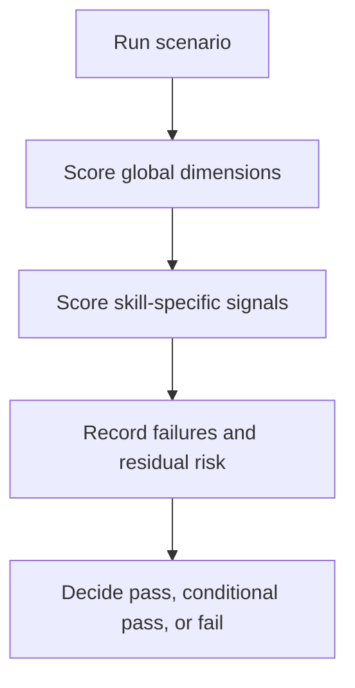

# Skill Evaluation Rubric

## Scenario

You want a repeatable scoring standard for reviewing whether an agent actually demonstrated the intended skill behavior during a scenario run.

## Recommended Skill Composition

- `scoped-tasking`
- `plan-before-action`
- `targeted-validation`

## Review Model

## Scoring Scale

| Score | Meaning |
| --- | --- |
| `2` | Clearly demonstrated and materially useful |
| `1` | Partially demonstrated, ambiguous, or inconsistently applied |
| `0` | Missing, contradicted, or replaced by the opposite behavior |

## Global Dimensions

Score these dimensions for every scenario:

| Dimension | Pass Signal | Failure Signal |
| --- | --- | --- |
| Scope discipline | The agent stays inside the smallest justified boundary | The agent drifts into broad exploration without evidence |
| Planning discipline | The agent states assumptions, working set, and intended sequence before editing | The agent edits before a clear plan exists |
| Change discipline | The agent prefers the smallest viable change or recommendation | The agent bundles unrelated cleanup or broad rewrites |
| Validation discipline | The agent chooses the narrowest meaningful check first | The agent defaults to broad validation without justification |
| Uncertainty handling | The agent preserves ambiguity and residual risk | The agent overclaims confidence or collapses conflicting evidence |

## Skill-Specific Pass vs. Fail

### `scoped-tasking`

- Pass: proposes a bounded initial working set and explains each scope expansion.
- Fail: scans widely by reflex or expands scope without stating why.

### `plan-before-action`

- Pass: states goal, assumptions, intended files, and next actions before non-trivial edits.
- Fail: starts editing while the plan or file list is still fuzzy.

### `minimal-change-strategy`

- Pass: selects a local, reviewable patch and defers unrelated cleanup.
- Fail: mixes the main task with cosmetic rewrites, renames, or opportunistic refactors.

### `targeted-validation`

- Pass: first validation step directly exercises the changed or analyzed surface.
- Fail: jumps to full builds or broad test suites without explicit risk-based reasoning.

### `context-budget-awareness`

- Pass: compresses the session state, drops stale hypotheses, and resumes from a smaller fault domain.
- Fail: preserves dead ends and keeps re-reading noisy artifacts without a sharper question.

### `read-and-locate`

- Pass: starts from the strongest clue and identifies likely edit points without repo-wide drift.
- Fail: reads large unrelated areas before establishing the local ownership path.

### `safe-refactor`

- Pass: states invariants and performs behavior-preserving structural changes in small steps.
- Fail: silently changes interfaces, output shape, or user-visible behavior.

### `bugfix-workflow`

- Pass: clarifies the symptom and fault domain before applying a fix.
- Fail: patches speculative causes without confirming the failure path.

### `multi-agent-protocol`

- Pass: uses tiered parallelism appropriately — Tier 1 for read-only exploration, Tier 2 with an explicit gate declaration for write-capable delegation — with clear assignments and merge expectations.
- Fail: splits tightly coupled work, launches overlapping write scopes, skips the Tier 2 gate declaration, or conflates explore and delegate tiers.

### `conflict-resolution`

- Pass: compares overlapping findings by evidence quality and preserves uncertainty where needed.
- Fail: collapses conflicting findings into one answer without adjudication or confidence notes.

## Decision Rule

- Pass: no critical dimension scores `0`, and the primary skills under review mostly score `2`.
- Conditional pass: no critical safety issue exists, but one or more primary skills score `1`.
- Fail: any primary skill clearly scores `0`, or the execution pattern contradicts the skill intent.

## Guardrails

- Do not average away a critical failure with strong performance elsewhere.
- Do not score only the final answer; score the execution behavior.
- Do not upgrade a `1` to a `2` unless the pass signal is clearly visible in the transcript.
- If evidence is missing, record uncertainty instead of guessing the score.
