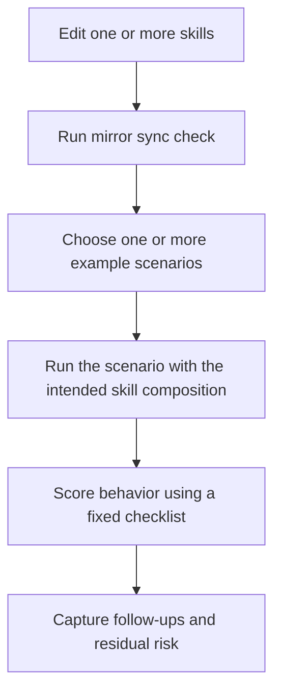

# Skill Testing Playbook

## Scenario

You changed one or more `SKILL.md` files and want a repeatable way to verify that the repository mirror is current, the intended behavior is still visible in agent runs, and regression notes can be captured without building a heavyweight evaluation harness.

## Recommended Skill Composition

- `scoped-tasking`
- `plan-before-action`
- `minimal-change-strategy`
- `targeted-validation`

## Test Flow



## Why This Flow

- The mirror sync check catches local discovery drift for Cursor.
- Example scenarios act as behavior-focused acceptance tests.
- A fixed checklist keeps reviews consistent across multiple test runs.
- A lightweight report template makes regression comparisons easier.

## Static Verification

Run:

```bash
python3 maintainer/scripts/install/manage-governance.py --check-local cursor
```

If needed:

```bash
python3 maintainer/scripts/install/manage-governance.py --sync-local cursor
```

## Scenario Matrix

| Example | Primary Skill Intent | What To Observe |
| --- | --- | --- |
| `single-agent-bugfix.md` | diagnosis before edit | symptom clarity, fault-domain narrowing, smallest viable fix, narrow validation |
| `read-and-locate.md` | bounded discovery | strong starting clue, small search radius, explicit likely edit points |
| `safe-refactor.md` | behavior-preserving structure change | invariants stated, extraction in small steps, validation after meaningful steps |
| `context-budgeted-debugging.md` | context compression and restart | stale hypotheses dropped, compressed summary, focused next step |
| `multi-agent-root-cause-analysis.md` | justified parallelism | low-coupling split, clear subagent assignments, merge and adjudication discipline |
| `phased-migration-planning.md` | schema-first phase planning | YAML is execution authority, strict four-file doc set, validators run after YAML, hotspot ownership explicit |

## Core Acceptance Checklist

- Scope was stated before broad exploration.
- The agent identified explicit assumptions or open questions.
- The intended working set was listed before editing.
- The response stayed within the requested task boundary.
- The smallest viable change or recommendation was preferred.
- Validation was narrow and relevant to the affected surface.
- Uncertainty was preserved when evidence was incomplete.
- Follow-up work was clearly separated from the main task.

For a scored review, use `examples/skill-evaluation-rubric.md` together with this playbook. The playbook tells you how to run the test; the rubric tells you how to score it.

## Prompt Template

Use a prompt shaped like this when you want a repeatable manual run:

```text
Task:
<paste the scenario or a close variant>

Required skills:
- <skill-1>
- <skill-2>
- <skill-3>

What I am testing:
- <expected behavior 1>
- <expected behavior 2>

Non-goals:
- <non-goal 1>
- <non-goal 2>
```

## Example Test Notes Template

```text
Run ID:
Date:
Scenario:
Skill composition:

Observed behavior:
- 

Passes:
- 

Failures:
- 

Residual risk:
- 

Follow-up:
- 
```

## Trigger Testing

Trigger testing verifies that the agent loads the correct skill(s) in response to a user prompt. This is separate from behavior testing, which verifies execution after loading.

### When to Run

- After changing any `description` field in a skill frontmatter.
- After changing `When to Use` or `When Not to Use` sections.
- After adding or removing skills from the available set.

### Trigger Test Matrix

The matrix lives in `maintainer/data/trigger_test_data.py`. Each case specifies:

- `prompt`: a simulated user message
- `expected_triggers`: skills that should be loaded
- `expected_non_triggers`: skills that should NOT be loaded
- `category`: the risk area being tested
- `notes`: why this case matters for triggerability

### Categories

| Category | What It Tests |
| --- | --- |
| `task-type` | Does the right skill activate for bugs, refactors, and features? |
| `agents-md-boundary` | Do simple tasks stay at AGENTS.md level while complex tasks escalate to the full skill? |
| `discovery` | Does read-and-locate trigger when the edit point is unknown? |
| `context-budget` | Does context-budget-awareness trigger when sessions grow noisy? |
| `multi-agent` | Does multi-agent-protocol trigger for parallel work? Does conflict-resolution stay dormant until needed? |
| `phase` | Do phase-plan and phase-execute trigger independently while phase-contract-tools stays hidden? |

### How to Run a Trigger Test

1. Pick a case from `maintainer/data/trigger_test_data.py`.
2. Start a fresh agent session (Cursor, Codex, or Claude Code).
3. Send the case prompt as the first user message.
4. Observe which skills the agent reads or references in its first response.
5. Score against expected triggers and expected non-triggers.

### Trigger Test Notes Template

```text
Case ID:
Date:
Platform: [Cursor | Codex | Claude Code]

Prompt:
<paste the case prompt>

Expected triggers:
- <skill-1>

Expected non-triggers:
- <skill-2>

Actual triggers observed:
-

Actual non-triggers confirmed:
-

False positives (loaded but should not have):
-

False negatives (not loaded but should have):
-

Notes:
-
```

### Scoring

For each case:

| Result | Meaning |
| --- | --- |
| `pass` | All expected triggers fired, no expected non-triggers fired |
| `partial` | Expected triggers fired but one or more non-triggers also fired (false positive) |
| `miss` | One or more expected triggers did not fire (false negative) |
| `fail` | Expected triggers did not fire AND unexpected skills fired |

A false negative (skill should have loaded but didn't) is more serious than a false positive (extra skill loaded unnecessarily) because a false negative means the agent misses the intended guidance entirely.

## Guardrails

- Do not treat mirror sync as a behavior test.
- Do not treat trigger testing as a behavior test — it only checks which skills are loaded, not how well they are followed.
- Do not score only the final answer; score the execution pattern.
- Do not widen the scenario during review unless the original prompt is insufficient.
- If behavior differs from the skill intent, capture the mismatch explicitly instead of averaging it away.
