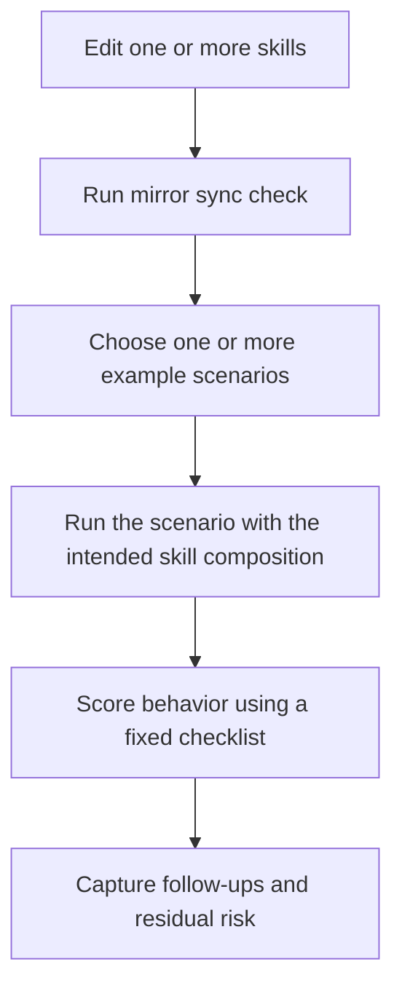

# Skill Testing Playbook

## Scenario

You changed one or more `SKILL.md` files and want a repeatable way to verify that the repository mirror is current, the intended behavior is still visible in agent runs, and regression notes can be captured without building a heavyweight evaluation harness.

## Recommended Skill Composition

- `scoped-tasking`
- `plan-before-action`
- `minimal-change-strategy`
- `targeted-validation`

## Test Flow



## Why This Flow

- The mirror sync check catches local discovery drift for Cursor.
- Example scenarios act as behavior-focused acceptance tests.
- A fixed checklist keeps reviews consistent across multiple test runs.
- A lightweight report template makes regression comparisons easier.

## Static Verification

Run:

```bash
python3 scripts/sync-cursor-skills.py --check
```

If needed:

```bash
python3 scripts/sync-cursor-skills.py
```

## Scenario Matrix

| Example | Primary Skill Intent | What To Observe |
| --- | --- | --- |
| `single-agent-bugfix.md` | diagnosis before edit | symptom clarity, fault-domain narrowing, smallest viable fix, narrow validation |
| `read-and-locate.md` | bounded discovery | strong starting clue, small search radius, explicit likely edit points |
| `safe-refactor.md` | behavior-preserving structure change | invariants stated, extraction in small steps, validation after meaningful steps |
| `context-budgeted-debugging.md` | context compression and restart | stale hypotheses dropped, compressed summary, focused next step |
| `multi-agent-root-cause-analysis.md` | justified parallelism | low-coupling split, clear subagent assignments, merge and adjudication discipline |

## Core Acceptance Checklist

- Scope was stated before broad exploration.
- The agent identified explicit assumptions or open questions.
- The intended working set was listed before editing.
- The response stayed within the requested task boundary.
- The smallest viable change or recommendation was preferred.
- Validation was narrow and relevant to the affected surface.
- Uncertainty was preserved when evidence was incomplete.
- Follow-up work was clearly separated from the main task.

For a scored review, use `examples/skill-evaluation-rubric.md` together with this playbook. The playbook tells you how to run the test; the rubric tells you how to score it.

## Prompt Template

Use a prompt shaped like this when you want a repeatable manual run:

```text
Task:
<paste the scenario or a close variant>

Required skills:
- <skill-1>
- <skill-2>
- <skill-3>

What I am testing:
- <expected behavior 1>
- <expected behavior 2>

Non-goals:
- <non-goal 1>
- <non-goal 2>
```

## Example Test Notes Template

```text
Run ID:
Date:
Scenario:
Skill composition:

Observed behavior:
- 

Passes:
- 

Failures:
- 

Residual risk:
- 

Follow-up:
- 
```

## Guardrails

- Do not treat mirror sync as a behavior test.
- Do not score only the final answer; score the execution pattern.
- Do not widen the scenario during review unless the original prompt is insufficient.
- If behavior differs from the skill intent, capture the mismatch explicitly instead of averaging it away.
