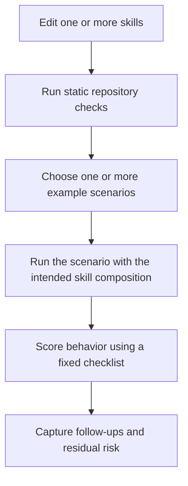

# Skill Testing Playbook

## Scenario

You changed one or more `SKILL.md` files and want a repeatable way to verify that repository references are still intact, the intended behavior is still visible in agent runs, and regression notes can be captured without building a heavyweight evaluation harness.

## Recommended Skill Composition

- `scoped-tasking`
- `targeted-validation`

Implementation uses a lightweight inline plan for short work, and `implementation-planning` when a durable plan artifact is part of the test surface.

## Test Flow


```mermaid
flowchart TD
    A[Edit one or more skills] --> B[Run static repository checks]
    B --> C[Choose one or more example scenarios]
    C --> D[Run the scenario with the intended skill composition]
    D --> E[Score behavior using a fixed checklist]
    E --> F[Capture follow-ups and residual risk]
```

## Why This Flow

- Static repository checks catch broken references before scenario testing.
- Example scenarios act as behavior-focused acceptance tests.
- A fixed checklist keeps reviews consistent across multiple test runs.
- A lightweight report template makes regression comparisons easier.

## Static Verification

Run:

```bash
python3 maintainer/scripts/analysis/validate_agent_skills.py
python3 maintainer/scripts/analysis/check_cross_references.py --fail-on-broken
python3 maintainer/scripts/evaluation/run_trigger_tests.py --mode report
```

## Scenario Matrix

| Example | Primary Skill Intent | What To Observe |
| --- | --- | --- |
| `single-agent-bugfix.md` | diagnosis before edit | symptom clarity, fault-domain narrowing, smallest viable fix, narrow validation |
| `safe-refactor.md` | behavior-preserving structure change | invariants stated, extraction in small steps, validation after meaningful steps |
| `implementation-planning.md` | durable implementation planning | acceptance map, file landing, verify checks, rollback notes, handoff to plan review |
| `multi-agent-root-cause-analysis.md` | justified parallelism | low-coupling split, clear subagent assignments, merge and adjudication discipline |
| `impact-analysis.md` | blast radius assessment before planning | outward tracing from edit point, structured impact summary, stop at framework boundaries, result feeds into plan |
| `self-delivery-review.md` | authorized diff quality check before testing | verifies current-task provenance, reviews the bounded diff, catches debug residuals, and fixes blocking issues first |

## Core Acceptance Checklist

- Scope was stated before broad exploration.
- The agent identified explicit assumptions or open questions.
- The intended working set was listed before editing.
- The response stayed within the requested task boundary.
- The smallest viable change or recommendation was preferred.
- Validation was narrow and relevant to the affected surface.
- Uncertainty was preserved when evidence was incomplete.
- Follow-up work was clearly separated from the main task.
- Impact was assessed before planning when the change affects shared interfaces.
- The diff was reviewed for quality issues before testing.
- Multi-PR tasks were split into runnable increments with explicit dependencies.
- Irreversible operations were identified and rollback strategies were stated.
- Ambiguous requirements triggered clarification before scoping.

For a scored review, use `examples/skill-evaluation-rubric.md` together with this playbook. The playbook tells you how to run the test; the rubric tells you how to score it.

## Prompt Template

Use a prompt shaped like this when you want a repeatable manual run:

```text
Task:
<paste the scenario or a close variant>

Required skills:
- <skill-1>
- <skill-2>
- <skill-3>

What I am testing:
- <expected behavior 1>
- <expected behavior 2>

Non-goals:
- <non-goal 1>
- <non-goal 2>
```

## Example Test Notes Template

```text
Run ID:
Date:
Scenario:
Skill composition:

Observed behavior:
- 

Passes:
- 

Failures:
- 

Residual risk:
- 

Follow-up:
- 
```

## Trigger Testing

Trigger testing verifies that the agent loads the correct skill(s) in response to a user prompt. This is separate from behavior testing, which verifies execution after loading.

### When to Run

- After changing any `description` field in a skill frontmatter.
- After changing `When to Use` or `When Not to Use` sections.
- After adding or removing skills from the available set.

### Trigger Test Matrix

The matrix lives in `maintainer/data/trigger_test_data.py`. Each case specifies:

- `prompt`: a simulated user message
- `expected_triggers`: skills that should be loaded
- `expected_non_triggers`: skills that should NOT be loaded
- `category`: the risk area being tested
- `notes`: why this case matters for triggerability

### Categories

| Category | What It Tests |
| --- | --- |
| `task-type` | Does the right skill activate for bugs, refactors, and features? |
| `lightweight-planning-boundary` | Do simple tasks stay on the direct-execution path while complex tasks load the appropriate skill? |

### How to Run a Trigger Test

1. Pick a case from `maintainer/data/trigger_test_data.py`.
2. Start a fresh session in the target Agent Skills runtime.
3. Send the case prompt as the first user message.
4. Observe which skills the agent reads or references in its first response.
5. Score against expected triggers and expected non-triggers.

### Trigger Test Notes Template

```text
Case ID:
Date:
Runtime and version: [name | version]

Prompt:
<paste the case prompt>

Expected triggers:
- <skill-1>

Expected non-triggers:
- <skill-2>

Actual triggers observed:
-

Actual non-triggers confirmed:
-

False positives (loaded but should not have):
-

False negatives (not loaded but should have):
-

Notes:
-
```

### Scoring

For each case:

| Result | Meaning |
| --- | --- |
| `pass` | All expected triggers fired, no expected non-triggers fired |
| `partial` | Expected triggers fired but one or more non-triggers also fired (false positive) |
| `miss` | One or more expected triggers did not fire (false negative) |
| `fail` | Expected triggers did not fire AND unexpected skills fired |

A false negative (skill should have loaded but didn't) is more serious than a false positive (extra skill loaded unnecessarily) because a false negative means the agent misses the intended guidance entirely.

## Guardrails

- Do not treat static repository checks as a behavior test.
- Do not treat trigger testing as a behavior test — it only checks which skills are loaded, not how well they are followed.
- Do not score only the final answer; score the execution pattern.
- Do not widen the scenario during review unless the original prompt is insufficient.
- If behavior differs from the skill intent, capture the mismatch explicitly instead of averaging it away.

## Skill Protocol v2 Test Harness Trace

```text
[task-validation: PASS | clarity:✓ | scope:✓ | safety:✓ | skill_match:✓ | action:proceed]
[triggers: targeted-validation:trigger]
[precheck: targeted-validation | result:PASS | checks:changed-surface-known validation-scope-chosen]
[output: targeted-validation | status:completed | confidence:high | command:"run static, trigger, and scenario checks" reason:"covers package integrity, triggerability, and behavioral acceptance" residual_risk:"long-tail prompts outside the sampled trigger set" | next:maintainer-review]
[validate: targeted-validation | result:PASS | checks:command reason residual_risk]
[drop: targeted-validation | reason:"verification sequence executed and results captured" | active:none]
```
