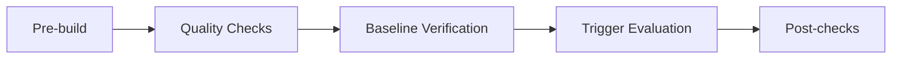

# CI Integration Guide

**Version:** 1.0  
**Date:** 2026-04-11  
**Status:** Active

## Overview

This guide documents how to integrate agent-skills quality checks, trigger evaluations, and baseline verification into CI/CD pipelines. It covers GitHub Actions, GitLab CI, and generic CI environments.

## Core Principles

1. **Compact mode by default**: Use pre-generated `skill_index.json` for consistent, fast evaluations
2. **Fail fast**: Run lightweight checks first (quality, cross-references) before expensive API calls
3. **Baseline enforcement**: Verify that token efficiency and quality metrics haven't regressed
4. **Parallel execution**: Run independent checks concurrently when possible

## CI Workflow Structure

### Recommended Pipeline Stages



1. **Pre-build**: Generate skill index, validate schema
2. **Quality Checks**: Skill quality, cross-references, protocol compliance
3. **Baseline Verification**: Token efficiency, skill size limits
4. **Trigger Evaluation**: LLM-based trigger accuracy (optional, slow)
5. **Post-checks**: Report generation, artifact archival

## GitHub Actions Example

### Basic Quality Gate

Create `.github/workflows/skill-quality.yml`:

```yaml
name: Skill Quality Checks

on:
  pull_request:
    paths:
      - 'skills/**'
      - 'docs/maintainer/**'
      - 'templates/governance/**'
      - 'maintainer/scripts/**'
  push:
    branches: [main]

jobs:
  quality-checks:
    runs-on: ubuntu-latest
    steps:
      - uses: actions/checkout@v4

      - name: Set up Python
        uses: actions/setup-python@v5
        with:
          python-version: '3.11'

      - name: Install dependencies
        run: |
          pip install pyyaml tiktoken

      - name: Generate skill index
        run: |
          python3 maintainer/scripts/analysis/generate_skill_index.py

      - name: Check skill quality
        run: |
          python3 maintainer/scripts/analysis/check_skill_quality.py --json > quality_report.json
          python3 maintainer/scripts/analysis/check_skill_quality.py --fail-on-issues

      - name: Check cross-references
        run: |
          python3 maintainer/scripts/analysis/check_cross_references.py --fail-on-broken

      - name: Measure prompt surface
        run: |
          python3 maintainer/scripts/analysis/measure_prompt_surface.py --actual-tokens --json > metrics.json

      - name: Upload reports
        uses: actions/upload-artifact@v4
        if: always()
        with:
          name: quality-reports
          path: |
            quality_report.json
            metrics.json
```

### Baseline Enforcement

Create `.github/workflows/baseline-check.yml`:

```yaml
name: Token Efficiency Baseline Check

on:
  pull_request:
    paths:
      - 'skills/**'
      - 'templates/governance/**'

jobs:
  baseline-check:
    runs-on: ubuntu-latest
    steps:
      - uses: actions/checkout@v4

      - name: Set up Python
        uses: actions/setup-python@v5
        with:
          python-version: '3.11'

      - name: Install dependencies
        run: pip install pyyaml tiktoken

      - name: Measure current metrics
        run: |
          python3 maintainer/scripts/analysis/measure_prompt_surface.py --actual-tokens --json > current_metrics.json

      - name: Check for regressions
        run: |
          python3 maintainer/scripts/analysis/check_baseline_regression.py \
            --baseline maintainer/data/token_efficiency_baseline.md \
            --current current_metrics.json \
            --fail-on-regression
```

### Trigger Evaluation (Optional)

Create `.github/workflows/trigger-tests.yml`:

```yaml
name: Trigger Accuracy Tests

on:
  pull_request:
    paths:
      - 'skills/**'
      - 'maintainer/data/trigger_test_data.py'
  workflow_dispatch:

jobs:
  trigger-tests:
    runs-on: ubuntu-latest
    # Only run if API key is available
    if: vars.OPENAI_API_KEY != ''
    steps:
      - uses: actions/checkout@v4

      - name: Set up Python
        uses: actions/setup-python@v5
        with:
          python-version: '3.11'

      - name: Install dependencies
        run: pip install pyyaml openai python-dotenv

      - name: Generate skill index
        run: |
          python3 maintainer/scripts/analysis/generate_skill_index.py

      - name: Run trigger tests (compact mode)
        env:
          OPENAI_API_KEY: ${{ secrets.OPENAI_API_KEY }}
        run: |
          python3 maintainer/scripts/evaluation/run_trigger_tests.py \
            --mode api \
            --compact-mode \
            --model gpt-4 \
            --concurrency 4 > trigger_results.txt

      - name: Upload results
        uses: actions/upload-artifact@v4
        if: always()
        with:
          name: trigger-test-results
          path: trigger_results.txt
```

## GitLab CI Example

Create `.gitlab-ci.yml`:

```yaml
stages:
  - validate
  - measure
  - test

variables:
  PYTHON_VERSION: "3.11"

before_script:
  - python3 -m pip install pyyaml tiktoken

generate-skill-index:
  stage: validate
  script:
    - python3 maintainer/scripts/analysis/generate_skill_index.py --verbose
  artifacts:
    paths:
      - maintainer/data/skill_index.json
    expire_in: 1 hour

skill-quality-check:
  stage: validate
  needs: [generate-skill-index]
  script:
    - python3 maintainer/scripts/analysis/check_skill_quality.py --fail-on-issues
    - python3 maintainer/scripts/analysis/check_cross_references.py --fail-on-broken
  rules:
    - changes:
        - skills/**/*
        - docs/maintainer/**/*

token-baseline-check:
  stage: measure
  needs: [generate-skill-index]
  script:
    - python3 maintainer/scripts/analysis/measure_prompt_surface.py --actual-tokens --json > current_metrics.json
  artifacts:
    paths:
      - current_metrics.json
    reports:
      metrics: current_metrics.json
  rules:
    - changes:
        - skills/**/*
        - templates/governance/**/*

trigger-tests:
  stage: test
  needs: [generate-skill-index]
  script:
    - pip install openai python-dotenv
    - |
      python3 maintainer/scripts/evaluation/run_trigger_tests.py \
        --mode api \
        --compact-mode \
        --model gpt-4 \
        --concurrency 4
  only:
    - merge_requests
  when: manual
```

## Generic CI Integration

### Pre-build Step

```bash
#!/bin/bash
set -e

echo "=== Generating skill index ==="
python3 maintainer/scripts/analysis/generate_skill_index.py

echo "=== Verifying skill index schema ==="
python3 -c "
import json
from pathlib import Path
index = json.loads(Path('maintainer/data/skill_index.json').read_text())
assert 'skills' in index
assert 'schema_version' in index
print(f'✓ Skill index valid: {len(index[\"skills\"])} skills')
"
```

### Quality Gate Script

```bash
#!/bin/bash
set -e

echo "=== Running quality checks ==="

# 1. Skill quality check
python3 maintainer/scripts/analysis/check_skill_quality.py --fail-on-issues

# 2. Cross-reference integrity
python3 maintainer/scripts/analysis/check_cross_references.py --fail-on-broken

# 3. Protocol compliance
python3 maintainer/scripts/evaluation/run_trigger_tests.py \
  --mode report \
  --fail-on-protocol-issues \
  --skip-protocol-readiness

echo "✓ All quality checks passed"
```

### Baseline Verification Script

```bash
#!/bin/bash
set -e

echo "=== Measuring token efficiency ==="

python3 maintainer/scripts/analysis/measure_prompt_surface.py \
  --actual-tokens \
  --json > current_metrics.json

echo "=== Checking for baseline regressions ==="

python3 -c "
import json
from pathlib import Path

current = json.loads(Path('current_metrics.json').read_text())

# Check governance templates don't exceed 5000 tokens
gov_tokens = current['governance_templates'].get('total_tokens', 0)
if gov_tokens > 5000:
    print(f'✗ Governance templates exceed 5000 token limit: {gov_tokens}')
    exit(1)

# Check average skill size doesn't exceed 2500 tokens
avg_skill_tokens = current['skill_files'].get('avg_tokens_per_skill', 0)
if avg_skill_tokens > 2500:
    print(f'✗ Average skill size exceeds 2500 token limit: {avg_skill_tokens:.0f}')
    exit(1)

# Check no skill exceeds 6000 tokens
for skill in current['skill_files']['skills']:
    if skill.get('tokens', 0) > 6000:
        print(f'✗ Skill {skill[\"skill_name\"]} exceeds 6000 token limit: {skill[\"tokens\"]}')
        exit(1)

print('✓ All baseline checks passed')
"
```

## Local Development Workflow

### Pre-commit Hook

Create `.git/hooks/pre-commit`:

```bash
#!/bin/bash

# Only run if skills or docs changed
if git diff --cached --name-only | grep -qE '^(skills/|docs/maintainer/)'; then
  echo "Running skill quality checks..."

  # Regenerate skill index
  python3 maintainer/scripts/analysis/generate_skill_index.py

  # Quick quality check
  python3 maintainer/scripts/analysis/check_skill_quality.py --fail-on-issues || {
    echo "✗ Skill quality check failed. Fix issues before committing."
    exit 1
  }

  # Cross-reference check
  python3 maintainer/scripts/analysis/check_cross_references.py --fail-on-broken || {
    echo "✗ Cross-reference check failed. Fix broken references."
    exit 1
  }

  # Stage the regenerated index
  git add maintainer/data/skill_index.json

  echo "✓ Quality checks passed"
fi
```

Make it executable:
```bash
chmod +x .git/hooks/pre-commit
```

### Manual Validation Checklist

Before pushing changes:

```bash
# 1. Regenerate skill index
python3 maintainer/scripts/analysis/generate_skill_index.py

# 2. Run all quality checks
python3 maintainer/scripts/analysis/check_skill_quality.py --fail-on-issues
python3 maintainer/scripts/analysis/check_cross_references.py --fail-on-broken

# 3. Measure token efficiency
python3 maintainer/scripts/analysis/measure_prompt_surface.py --actual-tokens

# 4. (Optional) Run trigger tests locally
python3 maintainer/scripts/evaluation/run_trigger_tests.py \
  --mode prompt \
  --compact-mode \
  --case bug-explicit
```

## Baseline Regression Detection

### What to Monitor

| Metric | Baseline | Warning Threshold | Fail Threshold |
|--------|----------|-------------------|----------------|
| Governance templates tokens | ~4,556 | +10% (5,012) | +20% (5,467) |
| Average skill tokens | ~2,351 | +10% (2,586) | +20% (2,821) |
| Max skill body tokens | ~5,177 | +10% (5,695) | +20% (6,212) |
| Skills over 500 lines | 0 | 1 | 2 |
| Quality passing rate | 50% | -10% (45%) | -20% (40%) |

### Regression Script

Create `maintainer/scripts/analysis/check_baseline_regression.py`:

```python
#!/usr/bin/env python3
"""Check for token efficiency baseline regressions."""

import argparse
import json
import sys
from pathlib import Path

def check_regression(baseline: dict, current: dict, threshold: float = 0.20) -> int:
    """Compare current metrics against baseline.

    Returns:
        0 if no regression
        1 if regression detected
    """
    issues = []

    # Check governance templates
    baseline_gov = baseline.get('governance_templates', {}).get('total_tokens', 0)
    current_gov = current.get('governance_templates', {}).get('total_tokens', 0)
    if current_gov > baseline_gov * (1 + threshold):
        issues.append(f"Governance templates: {current_gov} > {baseline_gov * (1 + threshold):.0f}")

    # Check average skill size
    baseline_avg = baseline.get('skill_files', {}).get('avg_tokens_per_skill', 0)
    current_avg = current.get('skill_files', {}).get('avg_tokens_per_skill', 0)
    if current_avg > baseline_avg * (1 + threshold):
        issues.append(f"Average skill: {current_avg:.0f} > {baseline_avg * (1 + threshold):.0f}")

    if issues:
        print("✗ Baseline regression detected:")
        for issue in issues:
            print(f"  - {issue}")
        return 1

    print("✓ No baseline regression")
    return 0

if __name__ == "__main__":
    parser = argparse.ArgumentParser()
    parser.add_argument("--baseline", required=True, help="Path to baseline metrics JSON")
    parser.add_argument("--current", required=True, help="Path to current metrics JSON")
    parser.add_argument("--threshold", type=float, default=0.20, help="Regression threshold (default: 0.20 = 20%%)")
    parser.add_argument("--fail-on-regression", action="store_true")
    args = parser.parse_args()

    baseline = json.loads(Path(args.baseline).read_text())
    current = json.loads(Path(args.current).read_text())

    exit_code = check_regression(baseline, current, args.threshold)
    if args.fail_on_regression:
        sys.exit(exit_code)
```

## Environment Variables

### Required

- None (all scripts work offline by default)

### Optional (for trigger evaluation)

| Variable | Purpose | Example |
|----------|---------|---------|
| `OPENAI_API_KEY` | API key for LLM trigger tests | `sk-...` |
| `OPENAI_BASE_URL` | Custom API endpoint | `https://api.z.ai/v1` |
| `OPENAI_MODEL` | Default model name | `gpt-4` |
| `OPENAI_EXTRA_BODY` | Provider-specific params | `{"thinking":{"type":"disabled"}}` |

## Performance Optimization

### Compact Mode Benefits

| Metric | Verbose Mode | Compact Mode | Improvement |
|--------|--------------|--------------|-------------|
| Metadata loading | 180ms | 15ms | 12× faster |
| Prompt size | ~5,000 chars | ~1,200 chars | 75% smaller |
| Token count | ~1,250 | ~300 | 76% reduction |
| File I/O | 18 reads | 1 read | 18× fewer |

### Parallelization

For trigger evaluation with API calls, use `--concurrency` flag:

```bash
# Serial (default, safest)
python3 maintainer/scripts/evaluation/run_trigger_tests.py --mode api --concurrency 1

# Parallel (4 concurrent requests, faster but rate-limit aware)
python3 maintainer/scripts/evaluation/run_trigger_tests.py --mode api --concurrency 4
```

**Rate limit considerations:**
- OpenAI Tier 1: 500 RPM → use `--concurrency 4`
- OpenAI Tier 2: 5,000 RPM → use `--concurrency 10`
- z.ai: Check your plan limits

## Troubleshooting

### Skill index out of sync

**Symptom**: Trigger tests show outdated skill descriptions

**Fix**:
```bash
python3 maintainer/scripts/analysis/generate_skill_index.py
git add maintainer/data/skill_index.json
```

### tiktoken not available

**Symptom**: `--actual-tokens` falls back to estimates

**Fix**:
```bash
pip install tiktoken
```

### Cross-reference check failures

**Symptom**: Broken references reported but they look correct

**Fix**: Check if the reference is a chain alias, field name, or example. Update `NON_SKILL_TERMS` in `check_cross_references.py` if it's a false positive.

### Baseline regression false positives

**Symptom**: CI fails on token count changes that are intentional

**Fix**: Update the baseline after verifying the change is justified:
```bash
python3 maintainer/scripts/analysis/measure_prompt_surface.py --actual-tokens
# Review the output, then update maintainer/data/token_efficiency_baseline.md
```

## See Also

- [Prompt Size Optimization](./prompt-size-optimization.md) - Compact mode architecture
- [Token Efficiency Baseline](../data/token_efficiency_baseline.md) - Current baseline metrics
- [Skill Chain Aliases](./skill-chain-aliases.md) - Valid chain reference list
- [ZAI Trigger Testing](./ZAI_TRIGGER_TESTING.md) - z.ai specific configuration
